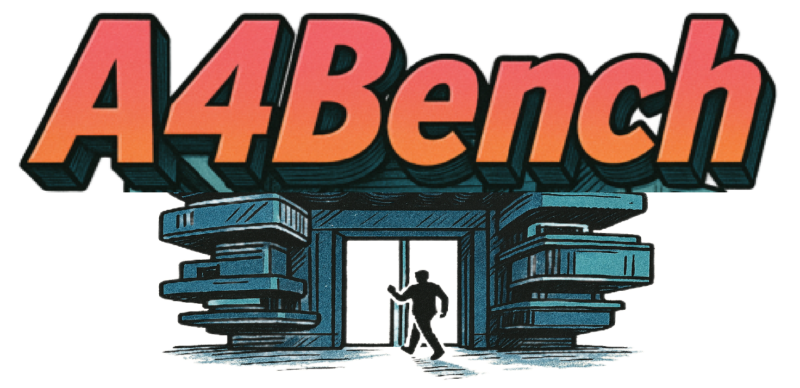

    

  

      
  

  
  <h1>Affordance Benchmark for MLLMs</h1>
  
_What affordance perception should MLLMs have?_

  

      <a>Junying Wang</a>1,2,
      <a>Wenzhe Li</a>2,
      <a>Yalun Wu</a>3,
      <a>Yingji Liang</a>4*,
      <a>Yijin Guo</a>2,3,
  

      <a href="https://github.com/lcysyzxdxc" target="_blank">Chunyi Li</a>2,3,
      <a href="https://scholar.google.com/citations?user=vi3W-m8AAAAJ&hl=zh-CN&oi=ao" target="_blank">Haodong Duan</a>2,
      <a href="https://zzc-1998.github.io/" target="_blank">Zicheng Zhang</a>2,3#,
      <a href="https://ee.sjtu.edu.cn/en/FacultyDetail.aspx?id=24&infoid=153&flag=153" target="_blank">Guangtao Zhai</a>2,3#
      
  

  

  1Fudan University,  2Shanghai AI Lab,
  
   
  

  3Shanghai Jiaotong University, 4East China Normal University
  
 

 #Corresponding author. 
   

  

   
  <a href="https://arxiv.org/abs/2506.00893"><strong>Paper</strong></a> |
<a href="https://github.com/JunyingWang959/A4Bench"><strong>Github</strong></a> |
 <a href="https://huggingface.co/datasets/JunyingWang/A4Bench"><strong>Data</strong></a> 
  

      
  

  The motivation of the **A4Bench**. The affordance theory proposed by James J. Gibson defines the action possibilities
provided by the object for organisms. Evaluating the affordance perception abilities of MLLMs can help enable more efficient
task execution and improved adaptability to diverse environments for AI systems.

  
## A4Bench Samples

Typical samples from the **A4Bench**. Each sample is accompanied by a image-question-answer pair. **A4Bench** evaluates
models across diverse discplines (*Constitutive Affordance*) and challenging dimensions (*Transformative Affordance*), ensuring
a comprehensive evaluation of the affordance perception capabilities.
  
  

  

      
  

## Citation
If you found this code helpful, please consider citing:
~~~
@article{wang2025affordance,
  title={Affordance Benchmark for MLLMs},
  author={Wang, Junying and Li, Wenzhe and Wu, Yalun and Liang, Yingji and Guo, Yijin and Li, Chunyi and Duan, Haodong and Zhang, Zicheng and Zhai, Guangtao},
  journal={arXiv preprint arXiv:2506.00893},
  year={2025}
}
~~~

